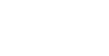

<h1 align="center">
   
</h1>

<h4 align="center"> 
	🚧 Space Invaders 🚀 Concluido...  🚧
</h4>

## 📚 Descrição
Este projeto é muito especial para mim, pois comecei a desenvolvê-lo quando ainda estava na faculdade e, após um longo período, decidi retomá-lo. É um projeto incrível: um clone do clássico Space Invaders, totalmente desenvolvido na Godot. O jogo permite personalizar sons e músicas, e o objetivo é controlar a nave para destruir os alienígenas antes que eles a alcancem. À medida que avançam, os aliens se tornam mais rápidos, aumentando o desafio e a diversão.

## 🛠 Tecnologias

As seguintes ferramentas foram usadas na construção do projeto:

-  [Godot](https://godotengine.org/)

## 📷 Video Demonstrativo

https://github.com/user-attachments/assets/a2922fcb-f285-40c4-bf00-199270721f13

## 🖥️ Plataforma adotada

  - PC

## 🎮 Ambientação: 
  - 2D

## 🎲 Gênero:
  1. Ação
  
## 🚸 Sensação:
  - Side Scroll
  
## 😛 Público Alvo:
  - 4 a 12 anos
  
## 🔢 Número de Níveis:
  1. Fase 1
